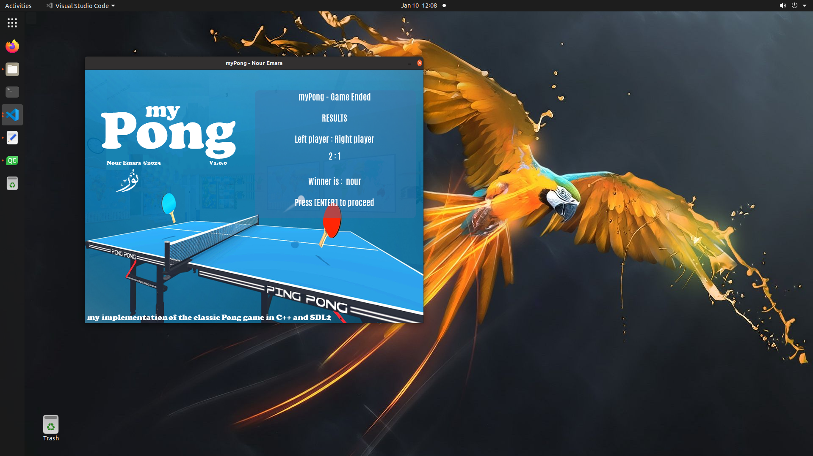

# myPong
myPong: my implementation of the classic Pong game in C++ and SDL2.

Contains a single mode where two human players can play against each other.

## Scenes
Game is split into following scenes:
1. A welcome scene, which contains the main menu.
2. A court scene, which contains the actual gameplay.
3. An end game scene, which contains the results from the court scene.

# Third-Party Dependencies
This implementation has external dependencies on the following libraries:
* SDL2
* [SDL2_ttf](https://www.libsdl.org/projects/SDL_ttf/) (ver. >=2.0.14)
* [SDL2_mixer](https://www.libsdl.org/projects/SDL_ttf/) (ver. >=2.0.14)
* * [SDL2_image](https://www.libsdl.org/projects/SDL_ttf/) (ver. >=2.0.14)
* [CMake](https://cmake.org/) (ver. >=3.7.2) (*optional*)
* A compilation toolkit supported by the CMake utility (e.g. gcc).


## Intalling Needed Tools and Dependencies on Ubuntu
You can use the script `setup.bash` to automatically install all the needed tools and dependencies. If interested, you can manually install the dependencies with the following terminal commands:
```terminal
sudo apt update

#install sdl2
sudo apt install libsdl2-dev libsdl2-2.0-0 -y;

#install sdl image  - if you want to display images
sudo apt install libjpeg-dev libwebp-dev libtiff5-dev libsdl2-image-dev libsdl2-image-2.0-0 -y;

#install sdl mixer  - if you want sound
sudo apt install libmikmod-dev libfishsound1-dev libsmpeg-dev liboggz2-dev libflac-dev libfluidsynth-dev libsdl2-mixer-dev libsdl2-mixer-2.0-0 -y;

#install sdl true type fonts - if you want to use text
sudo apt install libfreetype6-dev libsdl2-ttf-dev libsdl2-ttf-2.0-0 -y;
```

to link them, for example:
```terminal
g++ myProgram.cpp -o myProgram `sdl2-config --cflags --libs` -lSDL2 -lSDL2_mixer -lSDL2_image -lSDL2_ttf
```

For standard installation SDL2 and its libs are intalled to the following pathes:
* SDL2 include dirs (for `SDL2, SDL2_TTF, SDL_IMAGE, SDL2_MIXER`): `/usr/include/SDL2`
* SDL2 Libs:
  * SDL2      : `/usr/lib/x86_64-linux-gnu/libSDL2main.a/usr/lib/x86_64-linux-gnu/libSDL2.so-lpthread`
  * SDL2_TTF  : `/usr/lib/x86_64-linux-gnu/libSDL2_ttf.so`
  * SDL_IMAGE : `/usr/lib/x86_64-linux-gnu/libSDL2_image.so`
  * SDL2_MIXER:`/usr/lib/x86_64-linux-gnu/libSDL2_mixer.so`


## Compilation
Easiest way to compile the code is to use the [CMake](https://cmake.org/) utility.


CMake compilation uses Find*-modules from the /cmake folder which specify where CMake looks for the required libraries.

Without any modifications, CMake will make use the following environment variable paths.
* SDL2DIR, which should point to the root directory of the SDL2 library.
* SDL2TTFDIR, which should point to the root directory of the SDL2_ttf library.

## Screenshots





# Database Design

```
CREATE TABLE users (
	userID      INTEGER NOT NULL,
	userName    TEXT NOT NULL,
	password    TEXT NOT NULL,
	score       INTEGER DEFAULT 0 NOT NULL,
	"level"     INTEGER DEFAULT 0 NOT NULL,
	ballX       INTEGER DEFAULT -1 NOT NULL,
	ballY       INTEGER DEFAULT -1 NOT NULL,
	leftPaddelY INTEGER DEFAULT -1 NOT NULL,
	rightPaddelY INTEGER DEFAULT -1 NOT NULL
);
```